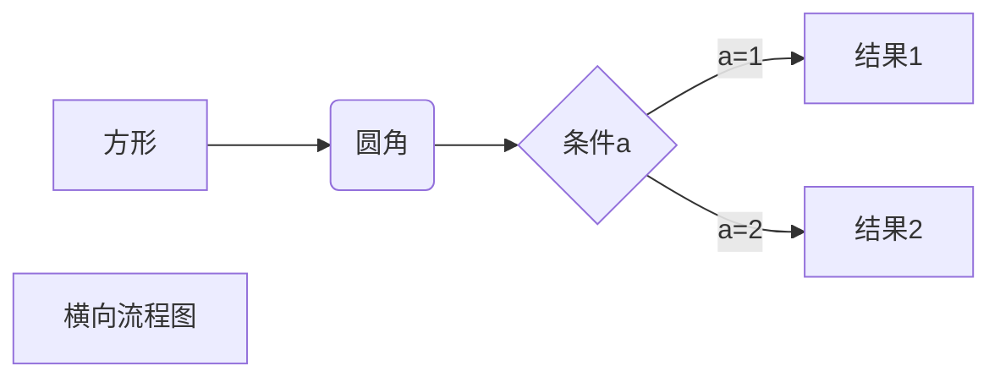
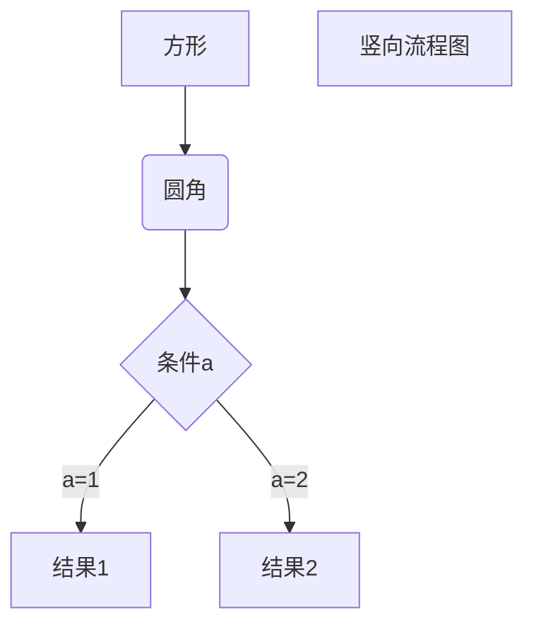

<!-- @import "[TOC]" {cmd="toc" depthFrom=1 depthTo=6 orderedList=false} -->

<!-- code_chunk_output -->

- [我的标题 dddddddd](#我的标题-dddddddd)
  - [432423](#432423)
        - [sdffsdfd](#sdffsdfd)
      - [学生管理系统（二）](#学生管理系统二)
    - [各式各样的](#各式各样的)

<!-- /code_chunk_output -->

<!--code_chunk_output-->
* [我的标题](#我的标题)
<!--code_chunk_output-->

# 我的标题 dddddddd
这是一个链接 [Markdown语法][1]。

## 432423
<br/> 
<br/> 
<br/> 

dasdas


dsad


##### sdffsdfd
[1]:https://markdown.com.cn

| Syntax      | Description | Test Text     |
| :---        |    :----:   |          ---: |
| Header      | Title       | Here's this   |
| Paragraph   | Text        | And more      |

Here's a simple footnote,[^1] and here's a longer one.[^bignote]

[^1]: This is the first footnote. :joy:

[^bignote]: Here's one with multiple paragraphs and code. 





```javascript {.line-numbers}
function add(x, y) {
  return x + y
}
``` 
#### 学生管理系统（二）


### 各式各样的 
